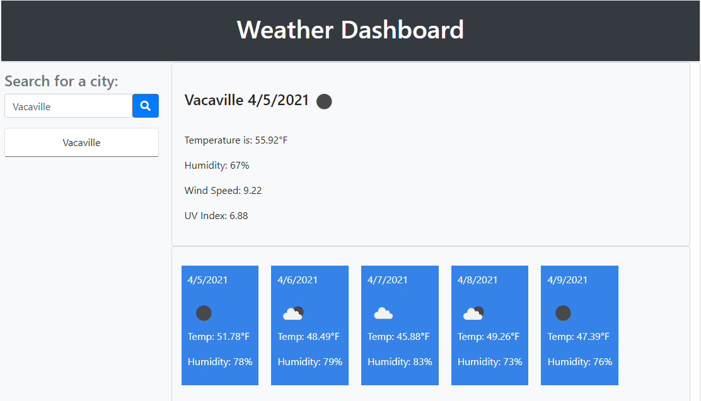
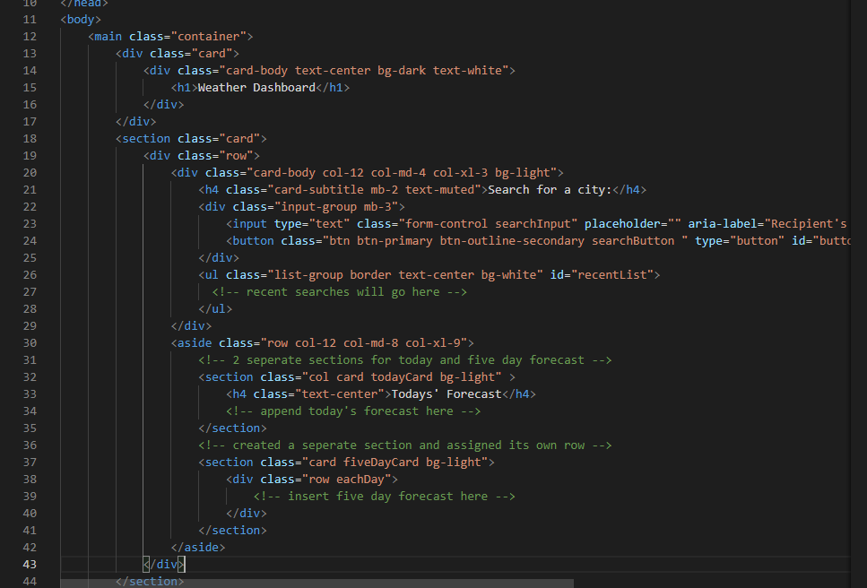
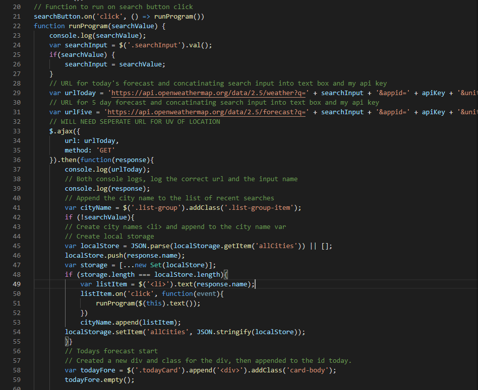

# Weather Dashboard

## In this assignment the ask was to build a weather dashboard where a user can enter in a city name and be provided with the forecast for that day and the 5 day forecast. In order to complete this assignment I ahd to start by acquiring an API from openweathermap.org. Then I needed to sort my way through the API to find the exact responses that I wanted to display for the user. I used Bootstrap to construct the page's layout and set cards for each section. The more exposure to the libraries is vyer good because I can find new things to format ideas and find my taste in customization. This assignment was again very challenging and time consuming, but worth the learning experience. I feel that with time, this will become second nature.

## Technology I Put to Work
- GitHub - repository storage for the project in order to amke changes, deploy them and push to a main branch. 

- GitBash - used for written commands and communicating witht he repository stored on GitHub.

- HTML - used to create and edit electronic documents stored on the web.

- Javascript - a programming language used to create specific events and make your website pop to viewers.
    - Conditional Statements
    - Local Storage
    - Functions

- jQuery - this is simppler way to format Javascript by adding the long text of standard Javascript into smaller jQuery methods.
    - Event Listeners
    - Selectors
    - DOM Manipulation

- Bootstrap - an open-source and free to use front end framework that helps design websites and apps.
    - Grid Selections
    - Rows / Columns

- Moment.js - a Javascript library that helps displaying date/time.

- Server Side API's - an interface that takes request and responds with message system that will provide publicly exposed endpoints.

## Site Preview

## How it was made!
``HTML

``Javascript

## The full dashboard is deployed here! Click the link to have a look!

[Full-Site](https://dnovelli1.github.io/weatherdashboard/)

## Links to my other Professional Site's!

[LinkedIn](https://www.linkedin.com/in/david-jacob-novelli/)

[GitHub](https://github.com/dnovelli1)